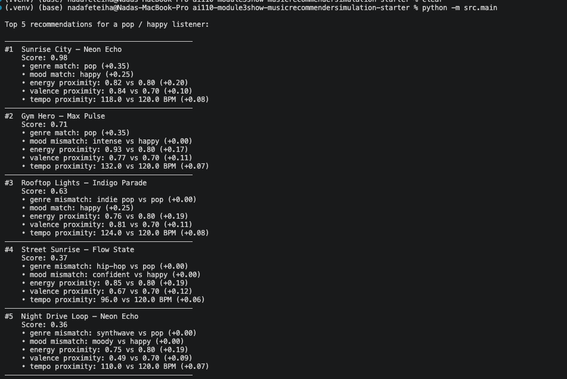

# 🎵 Music Recommender Simulation

## Project Summary

In this project you will build and explain a small music recommender system.

Your goal is to:

- Represent songs and a user "taste profile" as data
- Design a scoring rule that turns that data into recommendations
- Evaluate what your system gets right and wrong
- Reflect on how this mirrors real world AI recommenders

Replace this paragraph with your own summary of what your version does.

---

## How The System Works

### Pipeline Overview

```
 ┌──────────────────┐     ┌─────────────────────┐
 │   Song Catalog   │     │    UserProfile       │
 │  ─────────────   │     │  ─────────────────   │
 │  genre           │     │  favorite_genre      │
 │  mood            │     │  favorite_mood       │
 │  energy          │     │  target_energy       │
 │  valence         │     │  target_valence      │
 │  tempo_bpm       │     │  target_tempo_bpm    │
 └────────┬─────────┘     └──────────┬──────────┘
          │                          │
          └────────────┬─────────────┘
                       │  (one song at a time)
                       ▼
              ┌─────────────────┐
              │  score_song()   │
              │  ─────────────  │
              │  genre match?   │  ← binary: 1.0 or 0.0
              │  mood match?    │  ← binary: 1.0 or 0.0
              │  energy close?  │  ← 1 − |diff| / range
              │  valence close? │  ← 1 − |diff| / range
              │  tempo close?   │  ← 1 − |diff| / range
              │                 │
              │  weighted sum   │  ← weights sum to 1.0
              │  → score [0, 1] │
              └────────┬────────┘
                       │  all (song, score) pairs
                       ▼
            ┌──────────────────────┐
            │  recommend_songs()   │
            │  ──────────────────  │
            │  sort by score ↓     │
            │  slice top N         │
            └──────────┬───────────┘
                       │
                       ▼
            [(title, score), ...]
              best match first
```

---

### What features does each `Song` use?

Each `Song` has **5 scored features** and 2 stored-but-unscored fields:

| Feature | Type | Range | Role in scoring |
|---|---|---|---|
| `genre` | string | e.g. "pop", "lofi" | Categorical match |
| `mood` | string | e.g. "happy", "chill" | Categorical match |
| `energy` | float | 0.0 – 1.0 | Numerical proximity |
| `valence` | float | 0.0 – 1.0 | Numerical proximity |
| `tempo_bpm` | float | 60 – 180 | Numerical proximity |
| `danceability` | float | 0.0 – 1.0 | Stored, not yet scored |
| `acousticness` | float | 0.0 – 1.0 | Stored, not yet scored |

---

### What information does your `UserProfile` store?

| Field | Type | Purpose |
|---|---|---|
| `favorite_genre` | string | Categorical preference for genre |
| `favorite_mood` | string | Categorical preference for mood |
| `target_energy` | float | Ideal energy level (0.0–1.0) |
| `target_valence` | float | Ideal valence level (0.0–1.0), default 0.5 |
| `target_tempo_bpm` | float | Ideal tempo in BPM, default 120.0 |
| `likes_acoustic` | bool | Stored for future use |

---

### How does your `Recommender` compute a score for each song?

`score_song` computes a **weighted sum of five per-feature scores**, each normalized to [0, 1].

**Numerical features** use inverted normalized distance — closer to the user's preference scores higher:

```
s = 1 − |song_value − user_preference| / feature_range
```

**Categorical features** award a binary match bonus — `1.0` for exact match, `0.0` otherwise.

The five components are combined with weights that sum to 1.0:

| Feature | Weight | Rationale |
|---|---|---|
| `genre` | 0.35 | Strongest signal of sustained taste |
| `mood` | 0.25 | Captures the user's current emotional context |
| `energy` | 0.20 | Wrong energy disrupts a playlist immediately |
| `valence` | 0.12 | Fine-grained emotional tone refinement |
| `tempo_bpm` | 0.08 | Listeners tolerate tempo variance the most |

The final score is always a float in **[0.0, 1.0]**.

---

### How do you choose which songs to recommend?

`recommend_songs` applies two rules in sequence:

1. **Scoring Rule (local)** — `score_song` evaluates each song in isolation against the user profile. Each song gets a score independent of every other song.
2. **Ranking Rule (global)** — all scores are sorted highest-to-lowest and the top `N` are returned as `(song_title, score)` tuples.

The two steps are deliberately separate: scoring defines the metric, ranking uses it across the full catalog. Scoring alone can't tell you which songs are relatively better — that requires seeing all scores at once.

---

### Algorithm Recipe

The complete scoring formula for one song:

```
score = 0.35 × s_genre
      + 0.25 × s_mood
      + 0.20 × s_energy
      + 0.12 × s_valence
      + 0.08 × s_tempo
```

Where each component is computed as:

| Component | Formula | Output range |
|---|---|---|
| `s_genre` | `1.0` if `song.genre == favorite_genre` else `0.0` | {0.0, 1.0} |
| `s_mood` | `1.0` if `song.mood == favorite_mood` else `0.0` | {0.0, 1.0} |
| `s_energy` | `1 − \|song.energy − target_energy\| / 1.0` | [0.0, 1.0] |
| `s_valence` | `1 − \|song.valence − target_valence\| / 1.0` | [0.0, 1.0] |
| `s_tempo` | `1 − \|song.tempo_bpm − target_tempo_bpm\| / 120.0` | [0.0, 1.0] |

All weights sum to **1.0**, so the final score is always in **[0.0, 1.0]**.

Score interpretation:

| Score range | Meaning |
|---|---|
| 0.90 – 1.00 | Genre, mood, and all numerical features align closely |
| 0.60 – 0.89 | Genre or mood matches but some numerical features diverge |
| 0.35 – 0.59 | One categorical match, or purely numerical alignment |
| 0.00 – 0.34 | No categorical match and poor numerical fit |

---

### Known Biases and Limitations

**1. Genre over-prioritization**
With a weight of 0.35, genre is the single largest contributor to any score. A song that perfectly matches the user's mood, energy, valence, and tempo but belongs to a different genre has a hard ceiling of 0.65 — lower than a genre-matching song with mismatched mood and mediocre numerical fit (0.75). This means the system can surface a same-genre song the user dislikes over a cross-genre song they would actually enjoy.

**2. Catalog representation bias**
Genres with more songs in the catalog produce more opportunities to earn the full 0.35 genre bonus. A user whose favorite genre has only one song in the catalog has nearly no fallback when that song misses on mood or energy — the recommender degrades to numerical-only matching (max score 0.40) for that user, while a lofi or pop user has multiple genre matches to choose from.

**3. Exact string matching on genre and mood**
`"indie pop" != "pop"` is treated the same as `"metal" != "pop"` — both score 0.0 for genre. There is no concept of genre similarity. A song labeled `"indie pop"` that sounds identical to a pop song loses the full 0.35 bonus, which can push it below less similar songs that happen to share the exact genre string.

**4. Silent preference fields**
`likes_acoustic` is stored in `UserProfile` but never read by `score_song`. A user who sets this preference gets no benefit from it — the field has zero effect on any recommendation.

**5. Mood is session context, not long-term taste**
Mood is weighted at 0.25 but it reflects what a user wants *right now*, not what they generally like. A profile built from historical data may encode a stale mood that no longer reflects the user's current state, causing systematically mismatched recommendations.

---


## Getting Started

### Setup

1. Create a virtual environment (optional but recommended):

   ```bash
   python -m venv .venv
   source .venv/bin/activate      # Mac or Linux
   .venv\Scripts\activate         # Windows

2. Install dependencies

```bash
pip install -r requirements.txt
```

3. Run the app:

```bash
python -m src.main
```

### Example Output

Running the app with the default pop/happy profile produces ranked recommendations with per-feature score breakdowns:



Each result shows the song title and artist, the final score, and a bullet-point explanation of how each feature contributed — genre/mood matches and numerical proximity scores for energy, valence, and tempo.

### Running Tests

Run the starter tests with:

```bash
pytest
```

You can add more tests in `tests/test_recommender.py`.

---

## Experiments You Tried

Use this section to document the experiments you ran. For example:

- What happened when you changed the weight on genre from 2.0 to 0.5
- What happened when you added tempo or valence to the score
- How did your system behave for different types of users

---

## Limitations and Risks

Summarize some limitations of your recommender.

Examples:

- It only works on a tiny catalog
- It does not understand lyrics or language
- It might over favor one genre or mood

You will go deeper on this in your model card.

---

## Reflection

Read and complete `model_card.md`:

[**Model Card**](model_card.md)

Write 1 to 2 paragraphs here about what you learned:

- about how recommenders turn data into predictions
- about where bias or unfairness could show up in systems like this


---

## 7. `model_card_template.md`

Combines reflection and model card framing from the Module 3 guidance. :contentReference[oaicite:2]{index=2}  

```markdown
# 🎧 Model Card - Music Recommender Simulation

## 1. Model Name

Give your recommender a name, for example:

> VibeFinder 1.0

---

## 2. Intended Use

- What is this system trying to do
- Who is it for

Example:

> This model suggests 3 to 5 songs from a small catalog based on a user's preferred genre, mood, and energy level. It is for classroom exploration only, not for real users.

---

## 3. How It Works (Short Explanation)

Describe your scoring logic in plain language.

- What features of each song does it consider
- What information about the user does it use
- How does it turn those into a number

Try to avoid code in this section, treat it like an explanation to a non programmer.

---

## 4. Data

Describe your dataset.

- How many songs are in `data/songs.csv`
- Did you add or remove any songs
- What kinds of genres or moods are represented
- Whose taste does this data mostly reflect

---

## 5. Strengths

Where does your recommender work well

You can think about:
- Situations where the top results "felt right"
- Particular user profiles it served well
- Simplicity or transparency benefits

---

## 6. Limitations and Bias

Where does your recommender struggle

Some prompts:
- Does it ignore some genres or moods
- Does it treat all users as if they have the same taste shape
- Is it biased toward high energy or one genre by default
- How could this be unfair if used in a real product

---

## 7. Evaluation

How did you check your system

Examples:
- You tried multiple user profiles and wrote down whether the results matched your expectations
- You compared your simulation to what a real app like Spotify or YouTube tends to recommend
- You wrote tests for your scoring logic

You do not need a numeric metric, but if you used one, explain what it measures.

---

## 8. Future Work

If you had more time, how would you improve this recommender

Examples:

- Add support for multiple users and "group vibe" recommendations
- Balance diversity of songs instead of always picking the closest match
- Use more features, like tempo ranges or lyric themes

---

## 9. Personal Reflection

A few sentences about what you learned:

- What surprised you about how your system behaved
- How did building this change how you think about real music recommenders
- Where do you think human judgment still matters, even if the model seems "smart"

